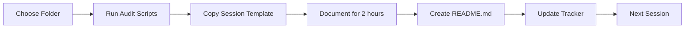

# WWFM Documentation Initiative - Quick Start Guide

**Goal**: Complete documentation of all code for knowledge transfer  
**Estimated Time**: 24-30 hours across 12-15 sessions  
**Current Coverage**: ~25% → Target: 90%

---

## 📚 Documentation Files Created

1. **[DOCUMENTATION-PROCESS.md](./DOCUMENTATION-PROCESS.md)**
   - Complete 12-session plan
   - Documentation standards and templates
   - Session-by-session breakdown

2. **[DOCUMENTATION-TRACKER.md](./DOCUMENTATION-TRACKER.md)**
   - Progress tracking spreadsheet
   - Session logs
   - Completion checklists

3. **[DOCUMENTATION-AUDIT-SCRIPTS.md](./DOCUMENTATION-AUDIT-SCRIPTS.md)**
   - Shell scripts for folder analysis
   - Quick audit commands
   - Documentation validation scripts

4. **[DOCUMENTATION-AUDIT-INITIAL.md](./DOCUMENTATION-AUDIT-INITIAL.md)**
   - Current state assessment
   - Priority rankings
   - Gap analysis

5. **[DOCUMENTATION-SESSION-TEMPLATE.md](./DOCUMENTATION-SESSION-TEMPLATE.md)**
   - Reusable template for each session
   - Structured note-taking
   - Quality checklists

---

## 🚀 How to Start

### Step 1: Review Current State
```bash
# Read the initial audit
cat DOCUMENTATION-AUDIT-INITIAL.md

# See what needs documentation
find . -type d -maxdepth 2 | while read dir; do
  if [ ! -f "$dir/README.md" ]; then
    echo "❌ $dir - No README"
  else
    echo "✅ $dir - Has README"
  fi
done
```

### Step 2: Prepare First Session
```bash
# Copy the session template
cp DOCUMENTATION-SESSION-TEMPLATE.md sessions/session-1-app.md

# Analyze the /app folder
./DOCUMENTATION-AUDIT-SCRIPTS.md  # Use the scripts here
```

### Step 3: Run Session 1
- **Target**: `/app` and `/app/api`
- **Time**: 2-3 hours
- **Use**: Session template to guide you
- **Create**: README.md files

### Step 4: Track Progress
- Update `DOCUMENTATION-TRACKER.md` after each session
- Check off completed items
- Note questions and discoveries

---

## 📊 Priority Order

### Critical (Do First)
1. `/app` - Application pages
2. `/app/api` - API endpoints
3. `/components/solutions/forms` - Form system
4. `/lib/supabase` - Database integration

### High Priority
5. `/components` - Component library
6. `/lib/services` - Business logic
7. `/types` - TypeScript types
8. `/lib` - Core utilities

### Medium Priority
9. `/hooks` - Custom hooks
10. `/contexts` - State management
11. `/supabase` - Database config
12. `/tests` - Update existing

### Low Priority
13. `/data` - Static data
14. `/tools` - Dev tools
15. `/public` - Assets

---

## 📝 README Template (Quick)

```markdown
# [Folder Name]

## Purpose
[Why this exists - 1 paragraph]

## Structure
- `main-file.ts` - [what it does]
- `helper.ts` - [what it does]
- `/sub/` - [what it contains]

## How to Use
```typescript
// Example code
import { thing } from './folder'
thing.doSomething()
```

## Business Logic
- Rule 1: [explanation]
- Rule 2: [explanation]

## Testing
```bash
npm test folder-name
```

## Notes
- [Important warning]
- [Known issue]
```

---

## ⏱️ Time Estimates

### Per Folder
- Simple folder (5-10 files): 1 hour
- Medium folder (10-25 files): 2 hours
- Complex folder (25+ files): 3-4 hours

### Total Project
- 12 sessions × 2 hours = 24 hours minimum
- With review and polish = 30 hours
- Across 2-3 weeks = Achievable

---

## 🎯 Success Criteria

### Documentation is complete when:
1. ✅ Every folder has a README
2. ✅ Business logic is explained
3. ✅ Code examples provided
4. ✅ New developer can understand in 1 day
5. ✅ No "tribal knowledge" required

### Quality Checks
- Can a new developer find what they need?
- Are business rules clear?
- Do examples actually work?
- Is technical debt documented?
- Are future improvements noted?

---

## 💡 Tips for Efficient Documentation

### Do's
- ✅ Start with WHY before HOW
- ✅ Include real code examples
- ✅ Document gotchas and edge cases
- ✅ Explain business decisions
- ✅ Link between related docs

### Don'ts
- ❌ Don't document obvious code
- ❌ Don't repeat what code already says
- ❌ Don't write novels - be concise
- ❌ Don't skip the business context
- ❌ Don't forget maintenance notes

---

## 🔄 Session Workflow



---

## 📞 When You're Stuck

### If you don't understand something:
1. Check related code files
2. Look for tests that show usage
3. Search for where it's imported
4. Check git history for context
5. Note it as a question for later

### Common Questions to Answer:
- What problem does this solve?
- Who uses this feature?
- What happens if it fails?
- How do you test it?
- What could be improved?

---

## 🏁 Ready to Start?

1. **Now**: Read `DOCUMENTATION-AUDIT-INITIAL.md`
2. **Session 1**: Focus on `/app` folder
3. **Use**: `DOCUMENTATION-SESSION-TEMPLATE.md`
4. **Track**: Update `DOCUMENTATION-TRACKER.md`
5. **Goal**: One session = one folder documented

Remember: The goal is not perfect documentation, but **useful** documentation that helps someone understand the system quickly.

---

**Questions?** Check the detailed files or note them for discussion in the next session.