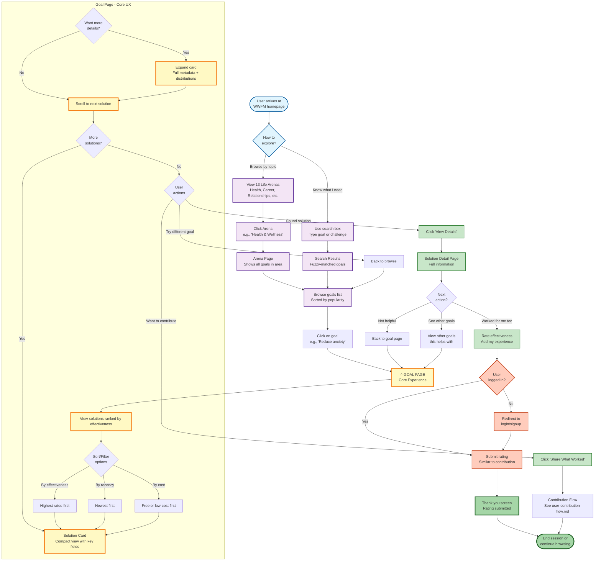

# Browse & Discover Flow

**Purpose**: Show user journey for discovering solutions to life challenges
**Audience**: UX designers, product managers, developers, reviewers
**Key**: This is the PRIMARY user experience of the platform

---

## User Journey Diagram



---

## Entry Points

### 1. Homepage (Direct Entry)
**URL**: `/`

**Elements**:
- Hero section with value proposition
- Search bar (prominent)
- Arena grid (13 life areas)
- Featured goals
- CTA: "Find What Works For You"

**User Types**:
- First-time visitors (need orientation)
- Returning users (know what they want)

---

### 2. Search (Power Users)
**Component**: `components/search/SearchBar.tsx`

**How It Works**:
```typescript
// Fuzzy search using PostgreSQL pg_trgm
SELECT * FROM goals
WHERE title % 'anxity'  -- Finds "anxiety" despite typo
ORDER BY similarity(title, 'anxity') DESC
LIMIT 20;
```

**Features**:
- Typo-tolerant (fuzzy matching)
- Instant results (as you type)
- Highlights matched text
- Shows goal category

**Examples**:
| User Types | Matches |
|------------|---------|
| "anxity" | "Reduce anxiety", "Manage social anxiety" |
| "slep" | "Sleep better", "Fall asleep faster" |
| "promtion" | "Get promoted", "Prepare for promotion" |

---

### 3. Browse by Arena (Explorers)
**Page**: `/arena/[slug]`

**13 Life Arenas**:
1. Health & Wellness
2. Mental Health
3. Relationships & Social
4. Career & Work
5. Personal Growth
6. Finance & Money
7. Home & Living
8. Education & Learning
9. Creativity & Hobbies
10. Fitness & Exercise
11. Nutrition & Diet
12. Sleep & Rest
13. Life Transitions

**Arena Page Shows**:
- Arena description
- All goals in arena (sorted by popularity)
- Stats: X goals, Y solutions
- Quick search within arena

---

## Goal Page Experience (Core UX)

**URL**: `/goal/[slug]`
**Component**: `components/goal/GoalPageClient.tsx`

### Layout Structure

```
┌──────────────────────────────────────────────────────┐
│ Goal Title: "Reduce Anxiety"                         │
│ Description: Find evidence-based solutions...        │
│                                                       │
│ [Share What Worked For You] [Filter] [Sort]         │
├──────────────────────────────────────────────────────┤
│                                                       │
│ ┌────────────────────────────────────────┐          │
│ │ Solution #1: Headspace Meditation App  │  ⭐⭐⭐⭐⭐ │
│ │ Category: Apps & Software              │  4.8/5   │
│ │ ───────────────────────────────────────│          │
│ │ Time to results: 1-2 weeks (45%)       │          │
│ │ Cost: $12.99/mo (subscription)         │          │
│ │ Used by: 127 people                    │          │
│ │                                         │          │
│ │ [Show Details ▼]                       │          │
│ └────────────────────────────────────────┘          │
│                                                       │
│ ┌────────────────────────────────────────┐          │
│ │ Solution #2: Cognitive Behavioral...   │  ⭐⭐⭐⭐⭐ │
│ │ Category: Therapists & Counselors      │  4.7/5   │
│ │ ...                                     │          │
│ └────────────────────────────────────────┘          │
│                                                       │
│ ... more solutions ...                               │
│                                                       │
└──────────────────────────────────────────────────────┘
```

### Solution Card (Compact View)

**Displays**:
- Solution name + category badge
- Effectiveness rating (stars + number)
- 3-4 key fields (category-specific)
- User count ("X of Y users")
- Data source indicator (AI vs User data)

**Key Fields by Category**:
- Medications: time_to_results, frequency, length_of_use, cost
- Exercise: time_to_results, frequency, duration, cost
- Therapists: time_to_results, session_frequency, session_length, cost

**Progressive Disclosure**:
- Default: Compact (3-4 fields)
- Expanded: All fields + distributions + charts

---

### Solution Card (Expanded View)

**Additional Details**:
- All category fields (not just top 3-4)
- Array fields as pills (side_effects, challenges)
- Distribution charts:
  ```
  Time to Results:
  ████████████████ 1-2 weeks (45%)
  ██████████ 2-4 weeks (30%)
  ████ 1-2 months (15%)
  ██ 2-3 months (10%)
  ```
- Data source breakdown
- Related solutions

**Interactions**:
- Click anywhere → Go to solution detail page
- Click "Rate" → Open rating form (if logged in)
- Click category → Filter by category

---

### Sorting & Filtering

**Sort Options**:
```typescript
- By Effectiveness (default) - Highest rated first
- By Recency - Newest submissions first
- By Cost - Free/low-cost first
- By Users - Most rated first
```

**Filter Options** (future):
```typescript
- By Category - Show only medications, apps, etc.
- By Cost Range - Free, < $20, < $50, etc.
- By Time to Results - Quick wins vs long-term
- By Data Source - User data vs AI baseline
```

---

## Solution Detail Page

**URL**: `/solution/[slug]`
**Purpose**: Deep dive into one solution

### Information Displayed

**Overview**:
- Full description
- Category details
- All effectiveness ratings (across all goals)
- Total users who tried it

**Works Best For** (Top Goals):
```
This solution works best for:
1. Reduce anxiety ⭐⭐⭐⭐⭐ 4.8/5 (127 users)
2. Improve sleep ⭐⭐⭐⭐ 4.2/5 (89 users)
3. Manage stress ⭐⭐⭐⭐ 4.0/5 (56 users)
```

**Field Distributions**:
- All fields with charts
- Breakdown by source (AI vs user)
- Confidence indicators

**User Context**:
- What challenges people faced
- Tips from successful users
- Common combinations with other solutions

**Actions**:
- Rate this solution (for current goal)
- See other goals this helps
- Share your experience

---

## Data Flow (Read Path)

### Goal Page Load
```
1. URL: /goal/reduce-anxiety
   ↓
2. Server Component: app/goal/[slug]/page.tsx
   ↓
3. Database Query:
   SELECT s.*, gil.effectiveness_rating, gil.aggregated_fields
   FROM solutions s
   JOIN goal_implementation_links gil ON s.id = gil.solution_id
   WHERE gil.goal_id = :goalId AND s.is_approved = true
   ORDER BY gil.effectiveness_rating DESC;
   ↓
4. Render: components/goal/GoalPageClient.tsx
   ↓
5. Frontend reads: aggregated_fields for display
   ↓
6. Browser: HTML rendered with solution cards
```

**Performance**:
- Server-side rendering (SSR)
- Solutions pre-sorted by effectiveness
- No client-side data fetching needed
- Fast Time to First Byte (TTFB)

---

## Search Implementation

**Component**: `lib/services/search.ts`

### 4-Layer Quality Filter

```typescript
// Layer 1: Fuzzy text match
const textMatch = await db.query(`
  SELECT * FROM goals
  WHERE title % $1  -- pg_trgm similarity
  ORDER BY similarity(title, $1) DESC
`);

// Layer 2: Approved only
const approved = textMatch.filter(g =>
  g.solutions.some(s => s.is_approved === true)
);

// Layer 3: Has solutions
const withSolutions = approved.filter(g =>
  g.solution_count > 0
);

// Layer 4: Active goals only
const active = withSolutions.filter(g =>
  g.is_active === true
);
```

**Result**: High-quality matches only

---

## User Decision Points

### At Homepage
```
Question: "How should I explore?"
Options:
  1. I know what I need → Search
  2. I want to browse topics → Arena grid
  3. I'm just exploring → Featured goals
```

### At Arena Page
```
Question: "Which goal resonates?"
Factors:
  - Goal title clarity
  - Number of solutions available
  - My personal challenges
```

### At Goal Page
```
Question: "Which solution to try?"
Factors:
  - Effectiveness rating
  - Time to results
  - Cost
  - Ease of implementation
  - Challenges faced by others
```

### At Solution Detail
```
Question: "What action to take?"
Options:
  1. This worked for me → Rate it
  2. I want to try this → Save/bookmark
  3. See more context → Read experiences
  4. Not relevant → Back to goal page
```

---

## Mobile vs Desktop Experience

### Desktop (1024px+)
- 2-column layout (sidebar + content)
- Expanded cards by default
- Hover interactions
- Keyboard shortcuts

### Tablet (768-1023px)
- 1-column layout
- Compact cards
- Touch-friendly spacing
- Simplified filters

### Mobile (< 768px)
- Stacked layout
- Minimized chrome
- Swipe gestures
- Bottom nav (future)

**Responsive Breakpoints**:
```css
sm: 640px   /* Mobile landscape */
md: 768px   /* Tablet */
lg: 1024px  /* Desktop */
xl: 1280px  /* Large desktop */
```

---

## Performance Metrics

### Goal Page Load
- **TTFB**: < 200ms (Vercel Edge)
- **FCP**: < 800ms (Server-rendered)
- **LCP**: < 1.2s (Images optimized)
- **CLS**: < 0.1 (Reserved space for cards)

### Search
- **Response time**: < 100ms (PostgreSQL index)
- **Debounce**: 300ms (reduce queries)
- **Results limit**: 20 (pagination future)

---

## Error States

### No Solutions Found
```
"No solutions yet for this goal"
[Share What Worked For You]
[Browse Similar Goals]
```

### Search No Results
```
"No goals found for 'xyz'"
Did you mean: [suggestions]
[Browse All Goals]
```

### Network Error
```
"Something went wrong"
[Retry] [Go Back]
```

---

## Analytics Events (Future)

**Track User Journey**:
```typescript
// Entry point
track('page_view', { entry_method: 'search' | 'arena' | 'direct' });

// Goal page
track('goal_viewed', { goal_id, goal_title });

// Solution interaction
track('solution_expanded', { solution_id, goal_id });
track('solution_clicked', { solution_id, goal_id });

// Actions
track('contribution_started', { goal_id });
track('rating_submitted', { solution_id, effectiveness });

// Exit
track('session_end', { duration, pages_viewed, actions_taken });
```

---

## Accessibility Features

### Keyboard Navigation
- Tab through all interactive elements
- Enter to select/expand
- Escape to collapse/close
- Arrow keys for list navigation

### Screen Readers
- Semantic HTML (nav, main, article)
- ARIA labels on all controls
- Skip to content link
- Announcement regions for dynamic content

### Visual
- WCAG AA contrast ratios (4.5:1 minimum)
- Focus indicators (visible outline)
- No color-only information
- Resizable text (up to 200%)

---

## SEO Optimization

### Goal Pages
```html
<title>Reduce Anxiety - Find What Works | WWFM</title>
<meta name="description" content="Discover 127 proven solutions to reduce anxiety, rated by real people. From meditation apps to therapy to lifestyle changes.">
<link rel="canonical" href="/goal/reduce-anxiety">

<!-- Open Graph -->
<meta property="og:title" content="Reduce Anxiety - Find What Works">
<meta property="og:type" content="website">
<meta property="og:url" content="/goal/reduce-anxiety">
```

### Structured Data
```json
{
  "@context": "https://schema.org",
  "@type": "HowTo",
  "name": "How to Reduce Anxiety",
  "step": [
    {
      "@type": "HowToStep",
      "name": "Try Headspace Meditation App",
      "itemListElement": { ... }
    }
  ]
}
```

---

## Key Takeaways

1. **Two entry paths**: Search (power users) vs Browse (explorers)
2. **Goal page is core UX**: Where discovery happens
3. **Progressive disclosure**: Compact → Expanded → Detail page
4. **Quality filters**: Only approved, specific solutions shown
5. **Data-driven ranking**: Effectiveness determines order

---

**Related Diagrams**:
- [User Contribution Flow](./user-contribution-flow.md) - How users add solutions
- [Form System](./form-system-flow.md) - Contribution form routing
- [System Context](../architecture/system-context.md) - Overall system

---

**Code References**:
- Homepage: `app/page.tsx`
- Arena page: `app/arena/[slug]/page.tsx`
- Goal page: `app/goal/[slug]/page.tsx`
- Solution detail: `app/solution/[slug]/page.tsx`
- Search: `lib/services/search.ts`
- Goal client: `components/goal/GoalPageClient.tsx`
