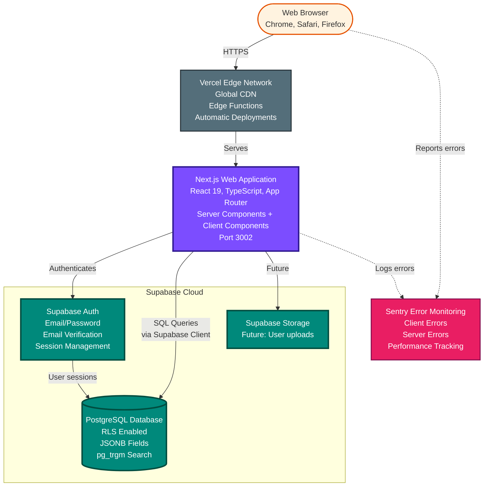
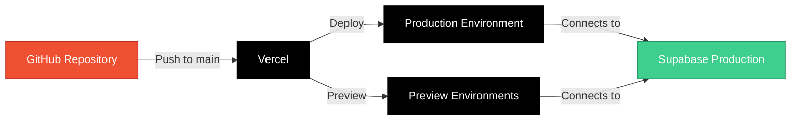

# WWFM Container Diagram

**Level**: C4 Level 2 - Container
**Audience**: Technical reviewers, architects, senior developers
**Purpose**: Show major technical components and their interactions

---

## Diagram



---

## Container Descriptions

### 1. Next.js Web Application
**Technology**: Next.js 15.3.2, React 19, TypeScript
**Responsibility**: Main application logic, UI, API

**Key Features**:
- **Server Components**: Default for better performance
- **App Router**: File-based routing with layouts
- **Server Actions**: Direct database mutations without API routes
- **Progressive Enhancement**: Works without JavaScript
- **TypeScript**: Full type safety

**Port**: 3002 (development)

---

### 2. PostgreSQL Database (Supabase)
**Technology**: PostgreSQL 15+ with Supabase extensions
**Responsibility**: All data persistence

**Key Features**:
- **Row Level Security (RLS)**: Security at database level
- **JSONB Fields**: Flexible field storage for solution metadata
- **pg_trgm Extension**: Fuzzy text search
- **Real-time**: Subscriptions to data changes (future)

**Tables**: 15+ (goals, solutions, ratings, users, etc.)

---

### 3. Supabase Auth
**Technology**: Supabase Auth (GoTrue)
**Responsibility**: User authentication and session management

**Key Features**:
- Email/password authentication
- Email verification required
- Session management
- JWT tokens
- Integrates with PostgreSQL RLS

**Security**: All auth tokens validated via RLS policies

---

### 4. Supabase Storage
**Technology**: Supabase Storage
**Responsibility**: File storage (not yet used)

**Future Use**:
- User profile images
- Solution images
- Document uploads

---

### 5. Vercel Edge Network
**Technology**: Vercel Edge Runtime
**Responsibility**: Hosting, CDN, deployment

**Key Features**:
- Global CDN (low latency worldwide)
- Automatic HTTPS
- Edge functions for server-side logic
- GitHub integration (auto-deploy)
- Preview deployments

**Benefits**: Optimized for Next.js, zero configuration

---

### 6. Sentry Error Monitoring
**Technology**: Sentry SDK
**Responsibility**: Error tracking and performance monitoring

**What's Monitored**:
- Client-side errors (React errors)
- Server-side errors (API/Server Component errors)
- Performance metrics (page load, API response times)
- User context (when errors occur)

**Integration**: Configured in instrumentation.ts

---

## Data Flow Patterns

### Read Flow (Browse/Search)
```
Browser → Vercel → Next.js Server Component → PostgreSQL → Render HTML → Browser
```

### Write Flow (Submit Solution)
```
Browser → Next.js Client Component → Server Action → PostgreSQL → Success Response
```

### Auth Flow
```
Browser → Next.js → Supabase Auth → Session Cookie → RLS Policies Apply
```

### Error Flow
```
Error Occurs → Sentry SDK → Sentry Cloud → Alert/Dashboard
```

---

## Technology Decisions

| Decision | Chosen | Alternative Considered | Why |
|----------|--------|----------------------|-----|
| Frontend Framework | Next.js 15 | Remix, Astro | Server Components, App Router, Vercel optimization |
| Database | PostgreSQL | MongoDB, MySQL | Relational data fits well, JSONB gives flexibility |
| Auth | Supabase Auth | Auth0, Clerk | Integrated with database RLS, cost-effective |
| Hosting | Vercel | Railway, Fly.io | Best Next.js support, edge functions, ease |
| Monitoring | Sentry | LogRocket, Datadog | Industry standard, great DX, reasonable cost |

---

## Deployment Architecture



---

## Security Layers

1. **Vercel Edge**: HTTPS only, DDoS protection
2. **Next.js**: Server-side validation, CSRF protection
3. **Supabase Auth**: JWT validation, session management
4. **PostgreSQL RLS**: Row-level data access control
5. **TypeScript**: Type safety prevents many runtime errors

---

## Scalability Considerations

| Component | Current Limit | Scaling Strategy |
|-----------|---------------|------------------|
| Next.js App | Vercel auto-scales | Serverless, handles 1000s requests/sec |
| PostgreSQL | Supabase Pro tier | Connection pooling, read replicas |
| Auth | Supabase limits | Rate limiting, monitoring |
| CDN | Vercel global | Already distributed globally |

**Current Status**: Architecture handles 10K+ concurrent users with current setup

---

## API Patterns

### No Traditional API Routes
WWFM uses **Server Actions** instead of REST/GraphQL API routes:

**Benefits**:
- Type-safe end-to-end
- No API layer to maintain
- Automatic serialization
- Built-in error handling

**Trade-off**: Web-only (no mobile app support yet)

---

**Previous Level**: [System Context](./system-context.md)
**Next Level**: [Component Diagram](./component-diagram.md) (shows internal Next.js structure)
