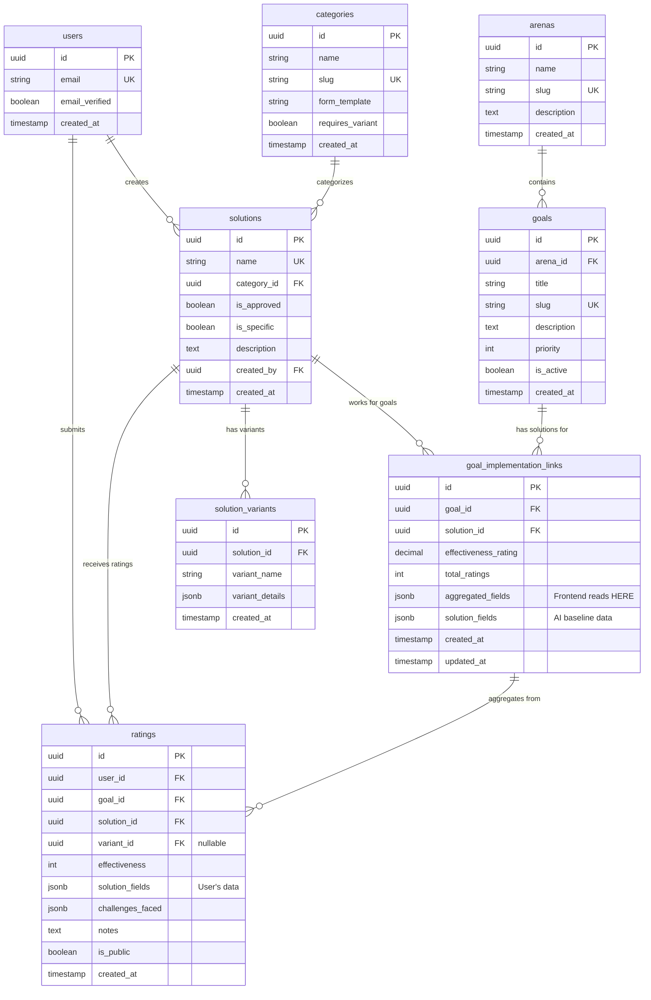

# WWFM Database Entity Relationship Diagram

**Purpose**: Show database schema, table relationships, and key fields
**Audience**: Database developers, backend developers, technical reviewers
**Database**: PostgreSQL 15+ (Supabase)

---

## Core Schema Diagram



---

## Table Descriptions

### Core Tables

#### 1. **arenas** (13 records)
Life areas that organize goals
- Health & Wellness
- Career & Work
- Relationships & Social
- Personal Growth
- Finance & Money
- etc.

#### 2. **goals** (228 active)
Specific life challenges users want to solve
- Examples: "Reduce anxiety", "Sleep better", "Get promoted"
- Each goal belongs to one arena
- Users browse and search goals

#### 3. **categories** (23 records)
Solution types that determine form template
- Examples: medications, therapists, apps, books
- Maps to one of 9 form templates
- Determines if variants are needed (only 4 categories)

#### 4. **solutions** (3,873 records)
Generic solution entries
- **Generic means**: Works across multiple goals
- **Specific means**: Not vague (e.g., "Headspace app" not "meditation")
- Requires admin approval before visible
- Linked to category for proper form handling

#### 5. **solution_variants** (4 categories only)
Specific versions of dosage-dependent solutions
- Only for: medications, supplements, natural remedies, beauty products
- Examples: "10mg tablet", "5000 IU capsule"
- Optional: Generic solution works without variant

---

### Junction/Link Tables

#### 6. **goal_implementation_links** ⭐ CORE TABLE
Connects goals to solutions with effectiveness data
- **One solution → Many goals** (same solution, different effectiveness)
- **aggregated_fields**: What frontend displays (user data + AI fallback)
- **solution_fields**: AI-generated baseline data
- **effectiveness_rating**: Average from all user ratings
- **total_ratings**: Count of user ratings

**Critical Design**: Effectiveness is goal-specific, not solution-specific

---

### User Data Tables

#### 7. **users**
User accounts
- Email/password auth via Supabase Auth
- Email verification required
- Privacy: Individual data never public

#### 8. **ratings**
Individual user contributions
- Links user → goal → solution (→ variant if applicable)
- **solution_fields**: User's specific responses (dosage, frequency, etc.)
- **challenges_faced**: What didn't work
- **is_public**: Always false (privacy first)
- Aggregated into goal_implementation_links for display

---

## Key Relationships

### One-to-Many (1:N)
```
arenas → goals
categories → solutions
solutions → solution_variants (4 categories only)
users → solutions (created by)
users → ratings
```

### Many-to-Many (N:M via junction)
```
goals ↔ solutions (via goal_implementation_links)
  - Same solution can work for multiple goals
  - Each with different effectiveness rating
```

### Critical Flow
```
User submits rating
  ↓
Creates entry in ratings table (individual data)
  ↓
Triggers aggregation
  ↓
Updates goal_implementation_links.aggregated_fields
  ↓
Frontend displays aggregated data
```

---

## Data Architecture: Two-Field System

### Why Two JSONB Fields?

**In goal_implementation_links:**

```sql
{
  "solution_fields": {         -- AI baseline (generated)
    "time_to_results": { ... }
  },
  "aggregated_fields": {       -- Frontend displays THIS
    "time_to_results": { ... } -- User data + AI fallback
  }
}
```

**Benefits**:
1. Preserve AI baseline (never overwritten)
2. Display user-contributed data when available
3. Fallback to AI data when no user data yet
4. Clear separation of concerns

**Rule**: Frontend ONLY reads `aggregated_fields`, never `solution_fields`

---

## Field Storage Format: DistributionData

All JSONB fields use consistent format:

```typescript
{
  "field_name": {
    "mode": "Most common value",
    "values": [
      {
        "value": "Option 1",
        "count": 45,
        "percentage": 45,
        "source": "research" | "user"
      },
      { ... }
    ],
    "totalReports": 100,
    "dataSource": "ai_research" | "user_aggregated"
  }
}
```

**Used for**: time_to_results, frequency, cost, side_effects, etc.

---

## Indexes

```sql
-- Performance optimizations
CREATE INDEX idx_goals_arena ON goals(arena_id);
CREATE INDEX idx_goals_slug ON goals(slug);
CREATE INDEX idx_solutions_category ON solutions(category_id);
CREATE INDEX idx_solutions_approved ON solutions(is_approved) WHERE is_approved = true;
CREATE INDEX idx_gil_goal ON goal_implementation_links(goal_id);
CREATE INDEX idx_gil_solution ON goal_implementation_links(solution_id);
CREATE INDEX idx_ratings_user ON ratings(user_id);
CREATE INDEX idx_ratings_goal ON ratings(goal_id);

-- Full-text search
CREATE INDEX idx_goals_title_trgm ON goals USING gin(title gin_trgm_ops);
CREATE INDEX idx_solutions_name_trgm ON solutions USING gin(name gin_trgm_ops);
```

---

## Row Level Security (RLS)

All tables have RLS enabled. Key policies:

### Public Read Access
```sql
-- Anyone can read approved solutions
goals: SELECT for all
solutions: SELECT WHERE is_approved = true
goal_implementation_links: SELECT for all (aggregated data only)
```

### Authenticated Write Access
```sql
-- Users can submit solutions (pending approval)
solutions: INSERT WHERE auth.uid() = created_by
ratings: INSERT WHERE auth.uid() = user_id

-- Users can only see their own ratings
ratings: SELECT WHERE auth.uid() = user_id
```

### Admin Access
```sql
-- Admins can approve solutions
solutions: UPDATE WHERE auth.role() = 'admin'
```

---

## Database Constraints

### Unique Constraints
- arenas.slug (URL-friendly identifier)
- goals.slug (URL-friendly identifier)
- solutions.name (prevent duplicates)
- users.email (one account per email)

### Foreign Key Constraints
- All FK relationships enforced
- ON DELETE policies: RESTRICT (prevent orphaned data)

### Check Constraints
```sql
-- Effectiveness must be 1-5
CHECK (effectiveness >= 1 AND effectiveness <= 5)

-- Ratings have valid effectiveness
CHECK (effectiveness_rating >= 1.0 AND effectiveness_rating <= 5.0)
```

---

## Data Quality Rules

### Solutions Table
- `is_approved = false` by default (admin must approve)
- `is_specific = true` enforced by quality filters
- Name must not contain generic terms ("therapy", "medication")

### Ratings Table
- `is_public = false` always (privacy first)
- Must link to existing goal + solution + user
- `solution_fields` must match category schema

### goal_implementation_links
- `aggregated_fields` must be populated (via aggregation)
- `effectiveness_rating` recalculated on new ratings
- `total_ratings` incremented atomically

---

## Migrations

All schema changes via Supabase migrations:
```
supabase/migrations/
├── 20250101000000_initial_schema.sql
├── 20250115000000_add_solution_variants.sql
├── 20250201000000_add_aggregated_fields.sql
└── ...36 total migrations
```

**Best Practice**: Never manual schema changes, always via migrations

---

## Query Patterns

### Most Common Queries

```sql
-- Get solutions for a goal (sorted by effectiveness)
SELECT s.*, gil.effectiveness_rating, gil.aggregated_fields
FROM solutions s
JOIN goal_implementation_links gil ON s.id = gil.solution_id
WHERE gil.goal_id = $1 AND s.is_approved = true
ORDER BY gil.effectiveness_rating DESC;

-- Search goals (fuzzy match)
SELECT * FROM goals
WHERE title % $1  -- pg_trgm similarity
ORDER BY similarity(title, $1) DESC
LIMIT 20;

-- Get user's ratings
SELECT r.*, s.name as solution_name, g.title as goal_title
FROM ratings r
JOIN solutions s ON r.solution_id = s.id
JOIN goals g ON r.goal_id = g.id
WHERE r.user_id = auth.uid()
ORDER BY r.created_at DESC;
```

---

## Backup & Recovery

- **Automatic backups**: Daily (Supabase)
- **Point-in-time recovery**: 7 days
- **Export**: pg_dump for manual backups
- **Test restores**: Monthly validation

---

**See Also**:
- [Complete Schema](./schema.md) - Full SQL definitions
- [Data Flow](../solution-field-data-flow.md) - How data moves through system
- [Container Diagram](../architecture/container-diagram.md) - Where database fits
