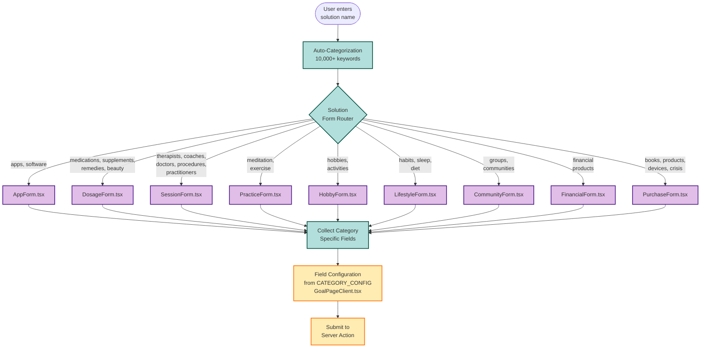

# Form System Architecture

**Purpose**: Show how 9 form templates efficiently handle 23 solution categories
**Audience**: Frontend developers, form maintainers, product managers
**Key Insight**: Smart routing eliminates template duplication

---

## Form Routing Diagram



---

## Template-to-Category Mapping

### 1. AppForm → 1 category
**Template**: `components/solutions/forms/AppForm.tsx`

**Categories**:
- apps_software

**Key Fields**:
- usage_frequency (Daily, Weekly, Monthly, etc.)
- subscription_type (Free, Freemium, Paid, etc.)
- cost (derived from subscription)
- time_to_results

**Example**: Headspace app, Calm app, Notion

---

### 2. DosageForm → 4 categories
**Template**: `components/solutions/forms/DosageForm.tsx`

**Categories**:
- medications
- supplements_vitamins
- natural_remedies
- beauty_skincare

**Key Fields**:
- frequency (Daily, Twice daily, Weekly, etc.)
- length_of_use (< 1 week, 1-4 weeks, 1-3 months, etc.)
- cost
- time_to_results
- **Array field**: side_effects (Nausea, Headache, Dizziness, etc.)

**Variant Handling**: These 4 categories CREATE solution_variants
- Dosage: "10mg", "20mg", "50mg"
- Form: "Tablet", "Capsule", "Liquid"

**Examples**:
- Medications: Prozac 20mg, Lexapro 10mg
- Supplements: Vitamin D 5000 IU, Magnesium 400mg
- Natural: Valerian root tea, CBD oil 25mg
- Beauty: Tretinoin 0.025% cream, Niacinamide serum

---

### 3. SessionForm → 5 categories
**Template**: `components/solutions/forms/SessionForm.tsx`

**Categories**:
- therapists_counselors
- coaches_mentors
- doctors_specialists
- medical_procedures
- alternative_practitioners

**Key Fields (varies by category)**:

**Therapists/Coaches/Practitioners**:
- session_frequency (Weekly, Biweekly, Monthly)
- session_length (30 min, 45 min, 60 min, 90 min)
- cost
- time_to_results

**Doctors/Medical Procedures**:
- session_frequency (Weekly, Monthly, Quarterly, etc.)
- wait_time (Same day, 1-2 weeks, 1-3 months) ← NOT session_length!
- cost
- time_to_results

**Examples**:
- Therapists: CBT therapy, EMDR, Talk therapy
- Coaches: Career coaching, Life coaching
- Doctors: Cardiologist, Dermatologist
- Procedures: Physical therapy, Acupuncture
- Alternative: Chiropractor, Massage therapy

---

### 4. PracticeForm → 2 categories
**Template**: `components/solutions/forms/PracticeForm.tsx`

**Categories**:
- meditation_mindfulness
- exercise_movement

**Key Fields (varies by category)**:

**Meditation**:
- practice_length (5 min, 10 min, 20 min, 30+ min)
- frequency (Daily, Few times/week, Weekly)
- cost
- time_to_results

**Exercise**:
- duration (< 15 min, 15-30 min, 30-60 min, 60+ min) ← Different from practice_length!
- frequency (Daily, 3-5x/week, 1-2x/week, etc.)
- cost
- time_to_results
- **Array field**: challenges (Time commitment, Physical limitations, etc.)

**Examples**:
- Meditation: Guided meditation, Breathing exercises, Body scan
- Exercise: Running, Yoga, Swimming, Weightlifting

---

### 5. HobbyForm → 1 category
**Template**: `components/solutions/forms/HobbyForm.tsx`

**Categories**:
- hobbies_activities

**Key Fields**:
- time_commitment (< 1 hr/week, 1-3 hrs/week, 3-5 hrs/week, etc.)
- frequency (Daily, Few times/week, Weekly, Monthly)
- cost
- time_to_results

**Examples**: Painting, Gardening, Photography, Playing guitar

---

### 6. LifestyleForm → 3 categories
**Template**: `components/solutions/forms/LifestyleForm.tsx`

**Categories**:
- habits_routines
- sleep
- diet_nutrition

**Key Fields (varies by category)**:

**Habits**:
- time_commitment (< 15 min/day, 15-30 min/day, 30-60 min/day, etc.)
- cost
- time_to_results
- **Array field**: challenges

**Sleep**:
- previous_sleep_hours (< 5 hrs, 5-6 hrs, 6-7 hrs, 7-8 hrs, 8+ hrs)
- still_following (Yes, No, Sometimes)
- cost
- time_to_results

**Diet**:
- weekly_prep_time (< 1 hr, 1-3 hrs, 3-5 hrs, 5+ hrs)
- still_following (Yes, No, Sometimes)
- cost
- time_to_results

**Examples**:
- Habits: Morning routine, Journaling, Cold showers
- Sleep: Sleep hygiene, Bedtime routine, Blue light blocking
- Diet: Mediterranean diet, Intermittent fasting, Meal prep

---

### 7. CommunityForm → 1 category
**Template**: `components/solutions/forms/CommunityForm.tsx`

**Categories**:
- groups_communities

**Key Fields**:
- meeting_frequency (Weekly, Biweekly, Monthly, etc.)
- group_size (1-on-1, Small 3-5, Medium 6-10, Large 10+)
- cost
- time_to_results

**Examples**: Support groups, Book clubs, Meetup groups, Online communities

---

### 8. FinancialForm → 1 category
**Template**: `components/solutions/forms/FinancialForm.tsx`

**Categories**:
- financial_products

**Key Fields**:
- financial_benefit (Saves money, Makes money, Reduces debt, etc.)
- access_time (Immediate, 1-7 days, 1-4 weeks, etc.)
- cost
- time_to_results

**Examples**: High-yield savings, Budgeting apps, Credit monitoring, Investment accounts

---

### 9. PurchaseForm → 3 categories
**Template**: `components/solutions/forms/PurchaseForm.tsx`

**Categories**:
- books_courses
- products_devices
- crisis_resources

**Key Fields (varies by category)**:

**Books/Courses**:
- format (Book, E-book, Online course, In-person, etc.)
- learning_difficulty (Beginner-friendly, Intermediate, Advanced)
- cost
- time_to_results

**Products/Devices**:
- ease_of_use (Very easy, Moderate, Requires setup, etc.)
- product_type (Physical product, Device, Tool, Kit, etc.)
- cost
- time_to_results

**Crisis Resources**:
- response_time (Immediate, Within 24h, Within week, etc.)
- cost
- time_to_results

**Examples**:
- Books: "Atomic Habits", "Feeling Good", Self-help books
- Products: Light therapy lamp, White noise machine, Weighted blanket
- Crisis: Crisis hotline, Emergency services, Mental health urgent care

---

## Field Configuration Source (SSOT)

**File**: `components/goal/GoalPageClient.tsx`
**Lines**: 56-407
**Object**: `CATEGORY_CONFIG`

```typescript
const CATEGORY_CONFIG = {
  medications: {
    keyFields: ['time_to_results', 'frequency', 'length_of_use', 'cost'],
    arrayField: 'side_effects'
  },
  exercise_movement: {
    keyFields: ['time_to_results', 'frequency', 'duration', 'cost'],
    arrayField: 'challenges'
  },
  // ... 21 more categories
}
```

**Rule**: When code and docs disagree, **CATEGORY_CONFIG WINS**

---

## Category-Specific Field Differences

### ⚠️ Common Mistakes to Avoid

| Category | ✅ Correct Fields | ❌ Wrong Fields |
|----------|------------------|-----------------|
| exercise_movement | frequency, **duration** | frequency, ~~session_length~~ |
| meditation_mindfulness | frequency, **practice_length** | frequency, ~~session_length~~ |
| doctors_specialists | session_frequency, **wait_time** | session_frequency, ~~session_length~~ |
| books_courses | **format**, learning_difficulty | ~~session_length~~, ~~frequency~~ |
| beauty_skincare | **skincare_frequency**, length_of_use | ~~frequency~~, length_of_use |

**Key Insight**: Different categories need DIFFERENT fields, even within same template!

---

## Auto-Categorization System

**File**: `components/solutions/SolutionFormWithAutoCategory.tsx`

### Keyword Detection
```typescript
const CATEGORY_KEYWORDS = {
  medications: ['pill', 'tablet', 'prescription', 'mg', 'medication', ...],
  apps_software: ['app', 'software', 'online tool', 'website', ...],
  therapists_counselors: ['therapy', 'therapist', 'counselor', 'psychologist', ...],
  // ... 10,000+ keywords total
};
```

### Detection Algorithm
1. Normalize solution name (lowercase, remove special chars)
2. Check each keyword set for matches
3. Return category with most matches
4. If tie or uncertain → Show manual picker

### Examples
| Solution Name | Detected Category | Why |
|---------------|-------------------|-----|
| "Headspace app" | apps_software | Contains "app" |
| "Prozac 20mg" | medications | Contains "mg" |
| "CBT therapy" | therapists_counselors | Contains "therapy" |
| "Morning run" | exercise_movement | Contains "run" |
| "Meditation" | meditation_mindfulness | Contains "meditation" |

---

## Form Wizard Pattern

All forms follow 3-step wizard:

### Step 1: Basic Information (Required)
- Solution name (pre-filled from router)
- Category (auto-detected or selected)
- Effectiveness rating (1-5 stars)

**Progress**: 33% complete

### Step 2: Category-Specific Fields (Required)
- Fields specific to category from CATEGORY_CONFIG
- All use dropdown selections (no free text)
- Validated against FORM_DROPDOWN_OPTIONS_REFERENCE.md

**Progress**: 66% complete

### Step 3: Optional Details (Optional)
- Notes (free text, max 500 chars)
- Challenges faced (multi-select)
- Demographics (optional, anonymous)

**Progress**: 100% complete

---

## Validation Rules

### Client-Side Validation
```typescript
// Real-time validation as user types/selects
- Required fields must be filled
- Dropdown values must be from approved list
- Notes max 500 characters
- Effectiveness 1-5 stars
```

### Server-Side Validation
```typescript
// Double-check everything (never trust client)
- All client rules re-checked
- Category matches form template
- Fields match category schema
- User is authenticated
- Email is verified
```

### Quality Filters
```typescript
// Block generic submissions
const BLOCKED_TERMS = ['therapy', 'medication', 'treatment', 'coach', ...];

// Force specificity
- Must include brand name, method, or specific approach
- "CBT therapy" ✅ (specific)
- "Therapy" ❌ (too generic)
```

---

## Form State Management

### Client State (React)
```typescript
const [step, setStep] = useState(1);
const [formData, setFormData] = useState({});
const [errors, setErrors] = useState({});
const [isSubmitting, setIsSubmitting] = useState(false);
```

### Persistence
- Form state saved to localStorage (prevents data loss)
- Restored on page refresh
- Cleared on successful submission

---

## Accessibility Features

- **Keyboard navigation**: Tab through all fields
- **Screen reader support**: Proper ARIA labels
- **Error announcements**: Screen readers announce validation errors
- **Focus management**: Auto-focus first error field
- **High contrast**: WCAG AA compliant colors

---

## Performance Optimizations

### Code Splitting
```typescript
// Only load form template when needed
const AppForm = lazy(() => import('./forms/AppForm'));
const DosageForm = lazy(() => import('./forms/DosageForm'));
// ... etc
```

### Bundle Size
- 9 templates total ~120KB (gzipped)
- Loaded individually (not all at once)
- Shared components extracted (UI library)

---

## Testing Strategy

### Unit Tests
- Each form template tested independently
- Field validation logic
- Auto-categorization accuracy

### E2E Tests
```bash
npm run test:forms
```

- Submit all 9 form types
- Both success and error paths
- Field validation
- Category routing

**Test Files**: `tests/forms/*.test.ts`

---

## Maintenance Guidelines

### Adding a New Category

1. **Decide template**: Which of 9 forms fits best?
2. **Update CATEGORY_CONFIG**: Add to `GoalPageClient.tsx`
3. **Update auto-categorization**: Add keywords
4. **Update form mapping**: In `SolutionFormWithAutoCategory.tsx`
5. **Add dropdown options**: In `FORM_DROPDOWN_OPTIONS_REFERENCE.md`
6. **Update SSOT docs**: In `docs/solution-fields-ssot.md`
7. **Add tests**: Create test fixtures

### Modifying Existing Form

1. **Check CATEGORY_CONFIG**: What fields are required?
2. **Update form template**: Modify appropriate form
3. **Update validation**: Both client and server
4. **Update tests**: Ensure all tests pass
5. **Update docs**: Keep SSOT aligned

---

## Key Takeaways

1. **9 templates handle 23 categories** through smart routing
2. **CATEGORY_CONFIG is SSOT** for field requirements
3. **Auto-categorization uses 10,000+ keywords**
4. **Different categories need different fields** (even in same template)
5. **Quality filters enforce specificity**

---

**Related Diagrams**:
- [User Contribution Flow](./user-contribution-flow.md) - Complete submission process
- [Database ERD](../database/database-erd.md) - Where form data is stored
- [Solution Fields SSOT](../solution-fields-ssot.md) - Field definitions

---

**Code References**:
- Form router: `components/solutions/SolutionFormWithAutoCategory.tsx`
- Form templates: `components/solutions/forms/*.tsx`
- Field config: `components/goal/GoalPageClient.tsx` (CATEGORY_CONFIG)
- Validation: `app/actions/submit-solution.ts`
