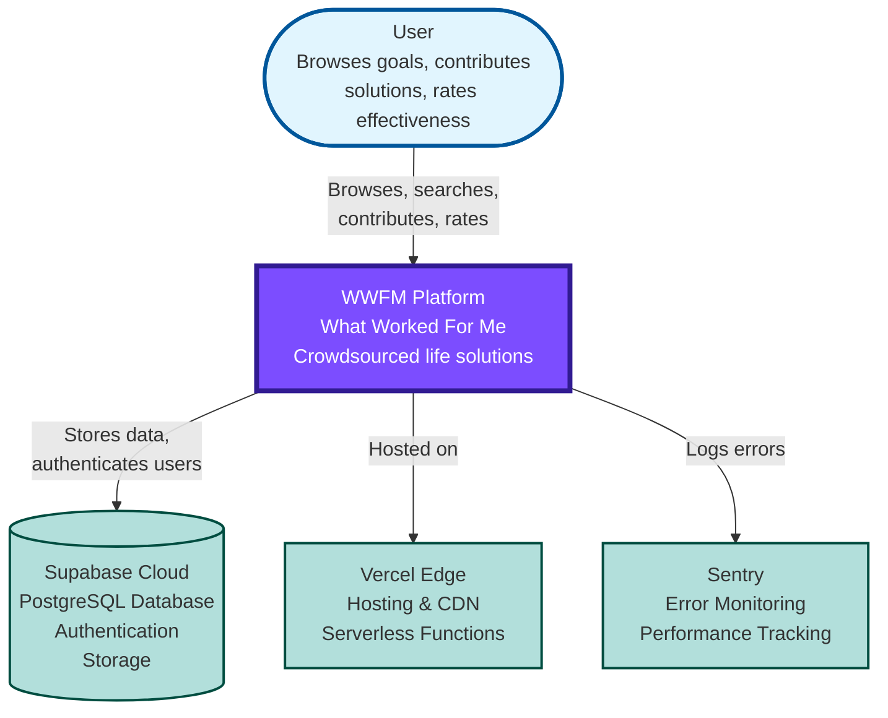

# WWFM System Context Diagram

**Level**: C4 Level 1 - System Context
**Audience**: Everyone (executives, reviewers, new developers)
**Purpose**: Show how WWFM fits into the larger ecosystem

---

## Diagram

---

## Key Elements

### Users (Actors)
- **Anonymous users**: Can browse, search, view solutions
- **Authenticated users**: Can contribute solutions, rate effectiveness, track history

### WWFM Platform (The System)
- Central platform for crowdsourcing solutions to life challenges
- Organizes by problems (goals) not products
- 228 active goals, 3,873 solutions, 99.6% coverage

### External Systems

**Supabase Cloud**
- PostgreSQL database with Row Level Security (RLS)
- User authentication (email/password)
- Real-time subscriptions
- Storage for future use

**Vercel Edge**
- Hosts Next.js application
- Edge functions for fast global response
- CDN for static assets
- Serverless deployment

**Sentry**
- Error tracking and monitoring
- Performance monitoring
- Release tracking
- User feedback collection

---

## Data Flow Summary

1. User interacts with WWFM Platform
2. Platform authenticates via Supabase Auth
3. Platform stores/retrieves data from PostgreSQL
4. Platform logs errors to Sentry
5. Everything hosted/served via Vercel Edge

---

## Technology Choices

| Component | Technology | Why Chosen |
|-----------|-----------|------------|
| Frontend | Next.js 15 (React) | Server Components, App Router, excellent DX |
| Database | PostgreSQL (Supabase) | Relational data, JSONB flexibility, RLS |
| Auth | Supabase Auth | Integrated, secure, email verification |
| Hosting | Vercel | Optimized for Next.js, edge functions, zero config |
| Monitoring | Sentry | Industry standard, excellent Next.js integration |

---

**Next Level**: See [Container Diagram](./container-diagram.md) for technical architecture details.
