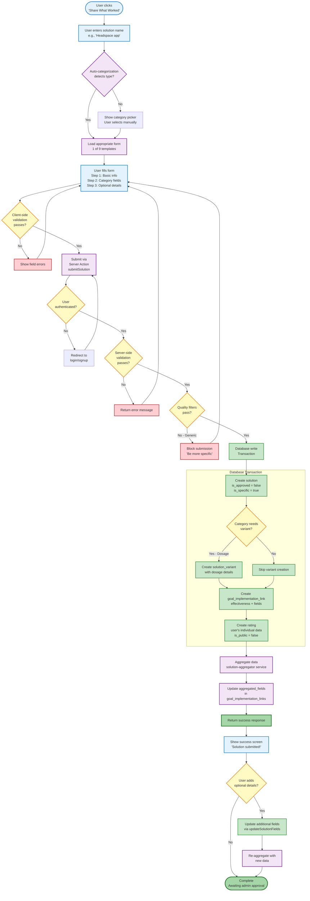

# User Contribution Flow

**Purpose**: Show how user-submitted solutions flow from form to display
**Audience**: Developers, QA testers, product managers
**Key**: This is the CORE data flow of the platform

---

## Complete Flow Diagram



---

## Flow Stages Explained

### Stage 1: Form Entry & Routing
**Components**: `SolutionFormWithAutoCategory.tsx`

1. User clicks "Share What Worked" on goal page
2. User enters solution name
3. **Auto-categorization**:
   - Checks 10,000+ keywords
   - Detects category (e.g., "app" → apps_software)
   - If uncertain, shows category picker
4. Routes to correct form template (1 of 9)

**Example**:
- "Headspace app" → DetectedCategory: apps_software → AppForm
- "Prozac 20mg" → DetectedCategory: medications → DosageForm

---

### Stage 2: Form Completion
**Components**: 9 form templates in `components/solutions/forms/`

**Three-Step Wizard**:

**Step 1: Basic Info**
- Solution name (already entered)
- Category (detected or selected)
- Effectiveness rating (1-5 stars)

**Step 2: Category-Specific Fields**
- Different fields per category (per SSOT)
- Example for medications: dosage, frequency, length_of_use, side_effects
- All fields validated against dropdown options

**Step 3: Optional Details**
- Notes (free text)
- Challenges faced
- Demographics (optional, anonymous)

**Validation**:
- Client-side: Real-time feedback on field errors
- Dropdown-only: No free text for key fields (ensures data quality)

---

### Stage 3: Submission & Validation
**Component**: Server Action `app/actions/submit-solution.ts`

**Validation Chain**:

1. **Authentication Check**
   - Requires logged-in user
   - Email must be verified
   - If not → redirect to login

2. **Server-Side Validation**
   - Field types match expected
   - Required fields present
   - Values in allowed ranges

3. **Quality Filters**
   - Block generic terms ("therapy", "medication")
   - Require specificity ("CBT therapy", "Prozac")
   - Test fixtures bypass with "(Test)" suffix

**Code Location**: `submit-solution.ts:224`

---

### Stage 4: Database Write (Transaction)
**Critical**: All writes in single transaction (atomicity)

```typescript
// Simplified pseudo-code
await db.transaction(async (trx) => {
  // 1. Create solution
  const solution = await trx.insert(solutions, {
    name,
    category_id,
    created_by: user.id,
    is_approved: false,  // Requires admin approval
    is_specific: true
  });

  // 2. Create variant (only if needed)
  let variant = null;
  if (categoryNeedsVariant(category)) {
    variant = await trx.insert(solution_variants, {
      solution_id: solution.id,
      variant_name,
      variant_details: {...}
    });
  }

  // 3. Create goal-solution link
  const link = await trx.insert(goal_implementation_links, {
    goal_id,
    solution_id: solution.id,
    effectiveness_rating: effectiveness,
    solution_fields: aiBaselineData,
    aggregated_fields: {} // Will populate via aggregation
  });

  // 4. Create user's rating
  await trx.insert(ratings, {
    user_id: user.id,
    goal_id,
    solution_id: solution.id,
    variant_id: variant?.id,
    effectiveness,
    solution_fields: userFieldData,
    is_public: false  // Privacy first
  });
});
```

**Rollback**: If any step fails, entire transaction rolls back

---

### Stage 5: Data Aggregation
**Component**: `lib/services/solution-aggregator.ts`

**Purpose**: Combine all user ratings into display-ready data

```typescript
// For each field (time_to_results, frequency, etc.)
aggregatedFields[fieldName] = {
  mode: mostCommonValue,
  values: [
    { value: "1-2 weeks", count: 45, percentage: 45, source: "user" },
    { value: "2-4 weeks", count: 30, percentage: 30, source: "user" },
    // ...
  ],
  totalReports: userRatings.length,
  dataSource: "user_aggregated"
};
```

**Writes to**: `goal_implementation_links.aggregated_fields`

**Frontend**: Reads ONLY from `aggregated_fields` for display

---

### Stage 6: Success Response
**UI**: Success screen with options

1. Show confirmation message
2. Display submitted solution details
3. Options:
   - View solution on goal page
   - Add more optional details
   - Submit another solution

**Status**: Solution marked "Pending approval"

---

## Data States

### Solution Lifecycle
```
Created → Pending Approval → Approved → Visible
(is_approved=false)       (is_approved=true)
```

**Until Approved**:
- ❌ Not visible in search
- ❌ Not shown on goal pages
- ✅ User can see in their dashboard
- ✅ Admin can see in moderation queue

**After Approved**:
- ✅ Visible to all users
- ✅ Appears in search results
- ✅ Shows on goal pages
- ✅ Others can rate it

---

## Field Data Flow

### Individual Data (Private)
```
User submits → ratings.solution_fields
                    ↓
              (Never shown directly)
                    ↓
              Used for aggregation only
```

### Aggregated Data (Public)
```
All user ratings → Aggregation service
                         ↓
            goal_implementation_links.aggregated_fields
                         ↓
                Frontend displays
```

**Privacy**: Individual responses never exposed, only aggregates

---

## Error Handling

### Client-Side Errors
- Field validation errors → Show inline below field
- Network errors → Show toast notification
- Form state preserved → User doesn't lose work

### Server-Side Errors
```typescript
try {
  await submitSolution(data);
} catch (error) {
  if (error.code === 'DUPLICATE_SOLUTION') {
    return { error: 'This solution already exists for this goal' };
  }
  if (error.code === 'QUALITY_FILTER') {
    return { error: 'Please be more specific. Avoid generic terms.' };
  }
  // Log to Sentry
  captureException(error);
  return { error: 'Something went wrong. Please try again.' };
}
```

**Sentry Integration**: All server errors logged for monitoring

---

## Performance Optimizations

### Form Loading
- Template loaded dynamically (code splitting)
- Only category fields loaded (not all 23 sets)
- Progressive enhancement (works without JS)

### Submission
- Optimistic UI updates (show success immediately)
- Background aggregation (doesn't block response)
- Database indexes on FK columns

### Aggregation
- Batched (not per-rating)
- Cached for 5 minutes
- Recomputed on new rating

---

## Security Measures

### Form Submission
1. CSRF token validation (Next.js automatic)
2. Rate limiting (future: 10 submissions/hour)
3. Email verification required
4. Server-side validation (never trust client)

### Database
1. RLS policies (can only insert own ratings)
2. Foreign key constraints (prevent orphaned data)
3. Transaction isolation (prevent race conditions)
4. Prepared statements (SQL injection protection)

---

## Testing Strategy

### E2E Tests
```bash
npm run test:setup      # Create fixtures
npm run test:forms      # Test all form submissions
```

**Coverage**:
- All 9 form templates
- Both anonymous (redirect) and authenticated flows
- Field validation
- Success/error states

**Test Files**: `tests/forms/*.test.ts`

---

## Key Takeaways

1. **Two-Phase Submission**: Required fields first, optional later
2. **Atomic Transactions**: All-or-nothing database writes
3. **Privacy First**: Individual data always private
4. **Quality Enforced**: Generic solutions blocked
5. **Approval Required**: Admin gate before public visibility

---

**Related Diagrams**:
- [Form System](./form-system-flow.md) - Template routing details
- [Database ERD](../database/database-erd.md) - Table structure
- [Container Diagram](../architecture/container-diagram.md) - System components

---

**Code References**:
- Form templates: `components/solutions/forms/`
- Auto-categorization: `components/solutions/SolutionFormWithAutoCategory.tsx`
- Server action: `app/actions/submit-solution.ts`
- Aggregation: `lib/services/solution-aggregator.ts`
