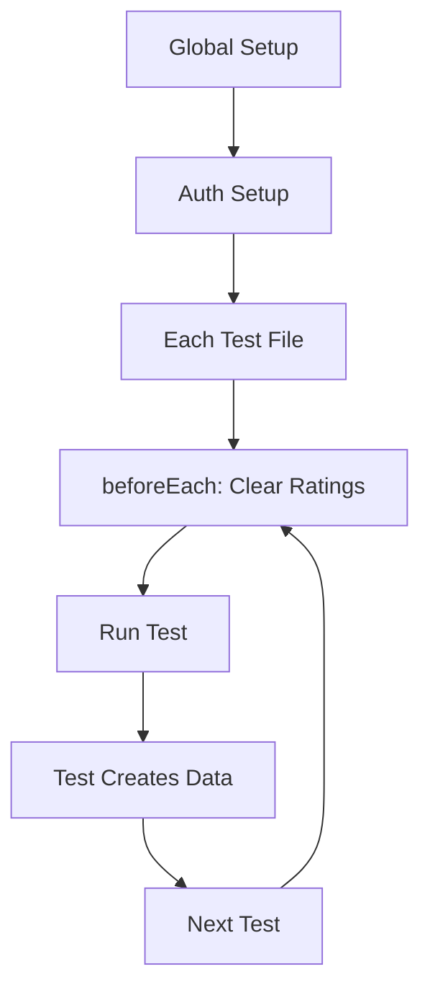
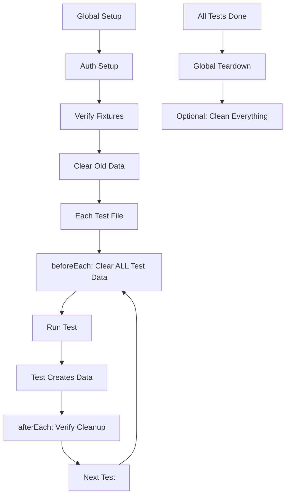

# Test Setup & Cleanup Assessment

> **Date**: January 26, 2025  
> **Focus**: Test prerequisites, fixtures, and cleanup processes

## Current Setup Architecture

### ✅ What's Working Well

#### 1. **Global Authentication Setup**
- `global-setup.ts` runs automatically before all tests
- Creates and saves auth state to `auth.json`
- Reused across all test runs for performance
- Test user: `test@wwfm-platform.com`

#### 2. **Test Fixtures**
- 23 permanent test solutions (one per category)
- All marked with "(Test)" suffix for identification
- Stored with `source_type = 'test_fixture'`
- Pre-approved and ready for testing

#### 3. **Per-Test Cleanup**
- Each test has `beforeEach` hook that clears previous ratings
- Uses `clearTestRatingsForSolution()` utility
- Preserves fixtures while clearing test data
- Allows tests to run repeatedly

### ⚠️ Issues Identified

#### 1. **🔴 CRITICAL: No Automatic Fixture Setup**
**Problem**: Test fixtures must exist in database but aren't automatically created
- `test:setup` script exists but isn't run automatically
- CI/CD doesn't run fixture setup
- New developers won't have fixtures

**Impact**: Tests fail on fresh database without manual setup

#### 2. **🟡 Incomplete Cleanup Between Test Runs**
**Problem**: Only clears ratings/links, not all test data
- Doesn't clear `solution_fields` JSON
- Doesn't clear aggregated data
- May leave orphaned records

**Impact**: Potential test pollution between runs

#### 3. **🟡 No Global Teardown**
**Problem**: No cleanup after all tests complete
- Test data accumulates over time
- No way to reset to clean state
- Manual cleanup required

#### 4. **🟡 CI/CD Missing Setup Steps**
**Problem**: GitHub Actions workflow doesn't ensure fixtures exist
```yaml
# Current: Missing fixture setup
run: npm run test:forms:ci

# Should be:
run: npm run test:setup && npm run test:forms:ci
```

## Recommended Improvements

### 1. **Add Automatic Fixture Verification**

Create `globalSetup` that ensures fixtures exist:

```typescript
// tests/setup/global-setup.ts
async function globalSetup(config: FullConfig) {
  // 1. Setup authentication (existing)
  await setupAuth();
  
  // 2. Verify/create fixtures (NEW)
  await verifyTestFixtures();
  
  // 3. Clear old test data (NEW)
  await clearAllTestData();
}
```

### 2. **Enhance Cleanup Utility**

```typescript
// tests/e2e/utils/test-cleanup.ts
export async function clearTestRatingsForSolution(solutionTitle: string) {
  // Current: Clears ratings and links ✅
  
  // Add: Clear solution_fields
  await supabase
    .from('ratings')
    .update({ solution_fields: null })
    .eq('goal_id', TEST_GOAL_ID)
    .eq('solution_id', solutionId);
    
  // Add: Reset aggregated fields
  await supabase
    .from('goal_implementation_links')
    .update({ 
      aggregated_fields: null,
      user_count: 0 
    })
    .eq('goal_id', TEST_GOAL_ID)
    .eq('implementation_id', variantId);
}
```

### 3. **Add Global Teardown**

```typescript
// tests/setup/global-teardown.ts
export default async function globalTeardown() {
  if (process.env.CLEAN_AFTER_TESTS === 'true') {
    console.log('🧹 Cleaning all test data...');
    await clearAllTestData();
  }
}

// playwright.config.ts
export default defineConfig({
  globalSetup: require.resolve('./tests/setup/global-setup.ts'),
  globalTeardown: require.resolve('./tests/setup/global-teardown.ts'), // NEW
});
```

### 4. **Fix CI/CD Workflow**

```yaml
# .github/workflows/form-tests.yml
- name: Setup test fixtures
  run: npm run test:setup
  env:
    SUPABASE_SERVICE_KEY: ${{ secrets.SUPABASE_SERVICE_KEY }}
    
- name: Run form tests
  run: npm run test:forms:ci
```

### 5. **Add Fixture Health Check**

```typescript
// tests/e2e/fixtures/fixture-health.spec.ts
test('verify all test fixtures exist', async ({ page }) => {
  for (const [category, title] of Object.entries(TEST_SOLUTIONS)) {
    const exists = await checkFixtureExists(title);
    expect(exists, `Fixture missing: ${title}`).toBeTruthy();
  }
});
```

## Implementation Priority

### Immediate Actions (Do Now)
1. ✅ Update CI workflow to run `test:setup`
2. ✅ Add fixture verification to global setup
3. ✅ Document fixture requirements in README

### Short-term (This Week)
1. Enhance cleanup to clear all test data
2. Add global teardown option
3. Create fixture health check test
4. Add `test:reset` command for manual cleanup

### Medium-term (This Month)
1. Implement fixture versioning
2. Add test data isolation per test file
3. Create fixture migration system
4. Add performance metrics for setup/teardown

## Setup Commands Reference

```bash
# One-time setup (creates fixtures)
npm run test:setup

# Run tests (uses existing fixtures)
npm run test:forms

# Reset everything (nuclear option)
npm run test:reset  # TODO: Create this

# Verify fixtures exist
npm run test:fixtures  # TODO: Create this
```

## Current Data Flow



## Proposed Data Flow



## Summary

The test setup is **mostly functional** but has critical gaps:

1. **Fixtures aren't automatically created** - Manual setup required
2. **Cleanup is incomplete** - Only clears some data
3. **CI/CD missing setup** - Will fail on fresh environment
4. **No global cleanup** - Data accumulates over time

With the recommended improvements, the test suite will be:
- ✅ **Self-contained** - Automatically creates what it needs
- ✅ **Idempotent** - Same results every run
- ✅ **Clean** - No test pollution
- ✅ **CI-ready** - Works on any environment